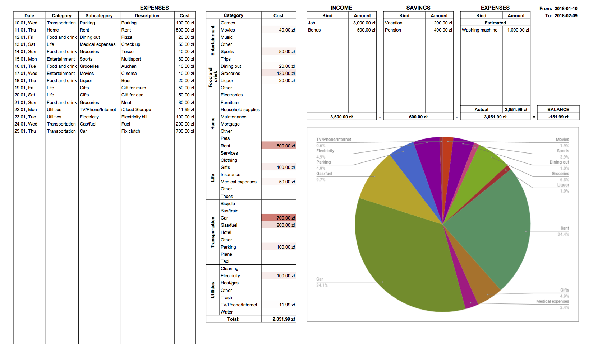

# Splitsheet

### Track your expenses and maintain personal budget using Splitwise!
Splitsheet is an expense tracker Google Docs spreadsheet template with a script that pulls data from Splitwise.

[Check out the template!](https://docs.google.com/spreadsheets/d/1jmyvqq2Z8VQJNCVITOizY_Dmv4KzZcVXAnBq0fPWM_4/edit?usp=sharing)

## Idea
I was looking for a convenient way to maintain home budget for some time and soon realized that a good portion of my expenses (ones shared with my friends) is already tracked in Splitwise. I wanted to avoid duplicating these expenses into a "proper" budget app and decided to use Splitwise for personal expenses as well. While being a great expenses sharing app, Splitwise has its limitations when it comes to analyzing your spending. **That's where Splitsheet comes in!**

## How to get started

#### Splitwise API key
You need **Splitwise API key** to use the script. Go to your [Splitwise dashboard](https://secure.splitwise.com/#/dashboard), open your account settings (*Your account* under your avatar) and find *Your apps* in *Advanced features*. Click *Register your application* and fill out the required fields:
- **Application name**: Splitsheet
- **Application description**: Splitsheet is an expense tracker Google Docs spreadsheet with a script that pulls data from Splitwise
- **Homepage URL**: https://github.com/bartoszkaminski/splitsheet

Optional fields can remain blank.  
Click *Register and get API key* to obtain your **Consumer Key** and **Consumer Secret** required in the next step.

#### Config
Open a [template spreadsheet](https://docs.google.com/spreadsheets/d/1jmyvqq2Z8VQJNCVITOizY_Dmv4KzZcVXAnBq0fPWM_4/edit?usp=sharing) and **make a copy**. Once you have your own Splitsheet, open *Config* sheet and fill in previously obtained Splitwise **Consumer Key** and **Consumer Secret**. Also, choose a **default currency** by providing its code (USD, EUR, PLN etc).

#### Authorize Splitsheet
Open a month sheet, choose *Splitwise* -> *Update* from the menu. Follow link from the dialog to **authorize** Splitsheet in Splitwise. One you get *"Success! You can close this tab"* response, you are all set! Use *Splitwise* -> *Update* once again and your expenses should be visible.

## Usage
There are some things you need to know before using Splitsheet.

#### Personal expenses
The most convenient way to track personal expenses in Splitwise is to create a group with you as the only member. Any expense you create there will be assigned to you.

#### General category
Unfortunately, Splitwise marks *Settle all balances* transaction with *General* category which messes up expenses summary. That's why Splitsheet filteres out all *General* transactions. Please use specific categories.

#### Currency
Splitsheet currently supports only one currency which must be specified in *Config* sheet. If you have expenses in other currencies, their cost will be showed as 0 and marked with red color.

#### Date range
You can choose a date range for each month in the upper right corner of the sheet. Provide a closed range, expenses from both endpoints dates' will be included.

#### Trips expenses
I decided that *Dining out*, *Car* or *Groceries* while on a trip is something different than at home. That's why the script changes category of all expenses that belong to groups of type *Trip* to a new category *Entertainment/Trips*

---
If you are unhappy with any customization I made, feel free to fork this repository and modify it to suit your needs 😉
